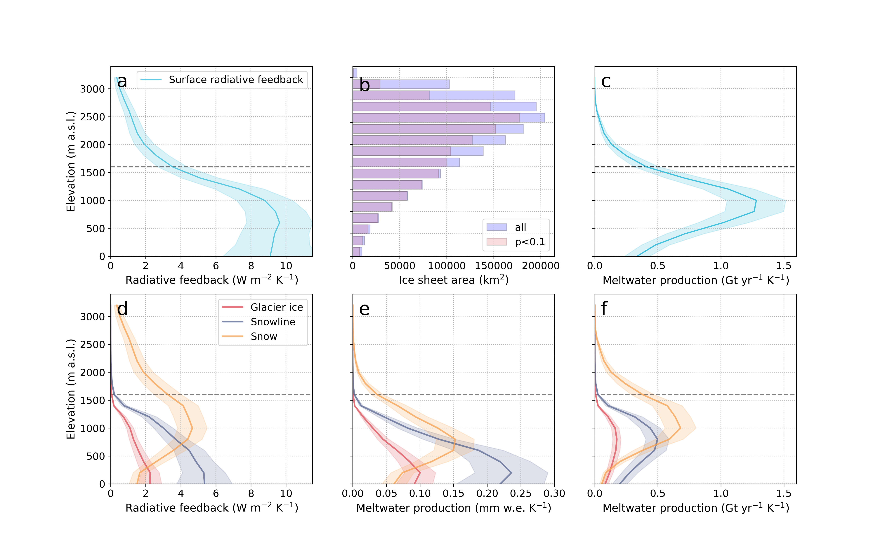

# Surface and cloud radiative feedbacks on the Greenland Ice Sheet

This repository contains the code and data references for the article:

> Ryan, J. C. (2025). **Contribution of surface and cloud radiative feedbacks to Greenland Ice Sheet meltwater production during 2002-2023**, 5, 538, [https://doi.org/10.1038/s43247-024-01714-y](https://doi.org/10.1038/s43247-024-01714-y)

## 🧊 Summary

In this study, we constrain the amount of melt due to processes that lower surface albedo and reduce cloud cover by developing a reference system approach that can be applied to satellite measurements of surface albedo and downward atmospheric radiative fluxes. Our findings provide a benchmark for assessing surface radiative feedbacks in state-of-the-art ice sheet models used to forecast Greenland's contribution to global sea levels in the next century and beyond.

## 🗂 Repository structure

```bash
feedbacks/
├── 01-pre-process
├── 02-analysis
├── 03-uncertainty	
├── 04-figures
├── LICENSE
└── README.md
```

## 📌 Data availability

Data required to reproduce the findings of this study are available on [Zenodo](https://zenodo.org/records/13743169).

## Figures


*Summer ice sheet radiative forcing by different processes for the 2002−2023 study period.*

 
*Summer ice sheet radiative forcing due to surface albedo by elevation.*


*Radiative feedback between summer near-surface (2 m) air temperatures and surface albedo by elevation.*


*Summer radiative forcing and feedback (at the surface) due to clouds by elevation.*

## Acknowledgments

This research was supported by NASA award #80NSSC21K1973. 

